# Briefing

## 🧾 Invoice Registry

**Invoice Registry** is a lightweight desktop application designed to log, manage, and track invoice records efficiently. Built using **Python** and **SQLite**, it provides a practical solution for small businesses, freelancers, or individuals who need a simple yet powerful invoice tracking tool.

## 🧪 Demo Variants

This application is distributed in two variants:

- **CLI-style build**  
  Packaged with terminal access for debugging or logging purposes. The terminal window opens alongside the GUI when launched.

- **GUI-only build**  
  Packaged to suppress the terminal window — provides a clean user-facing experience with no console output.

Both variants offer the same features and functionality.

## ⚙️ How to Run

1. Download the appropriate `.exe` file for your preference (CLI or GUI).
2. Double-click to run on Windows.
   - No installation required
   - Python is **not required** on the user’s system

> ⚠️ Note: These builds are standalone executables created with **PyInstaller**. Some antivirus software may falsely flag them — you can safely whitelist them if needed.

## 🛠️ Built With

- Python 3.x  
- SQLite  (For database)
- PyQt5 (for GUI)
- PyInstaller (for .exe conversion)

## 🗃️ Version

**Current release:** `v1.1.15`  
**Refactored version in progress** under `/refactor/` (excluded from current push)

## 🔜 Upcoming Improvements

- [ ] Full codebase refactor and modularization.
- [ ] Cleaner UI with theme options.
- [ ] Calendar system for better action planning.
- [x] README with screenshots and examples.
- [ ] Re-factor's README with screenshots and examples.
## 📢 Author

Made with 💻 by **Mirza Ishan Beg**

- [LinkedIn Profile] NOT SET
- [GitHub Profile](https://github.com/Mirza-Ishan-Beg)

---
# General Walkthrough

1. The software does not require installation, the .exe file is already constructed with pyinstaller to package all the necessary files and libraries required to run this application, it can be safely opened.
2. The application will prompt a username and password screen, here the program essentially does not have any sort of database, so it constructs one and creates a default 'Developer' role username by itself whose name is "xyz" and password is "12345678".
3.  The program necessarily gives a 'Developer' role, as it is my assumption that a dev will set this program up on the computer.
4. After this, you will be prompted with this screen: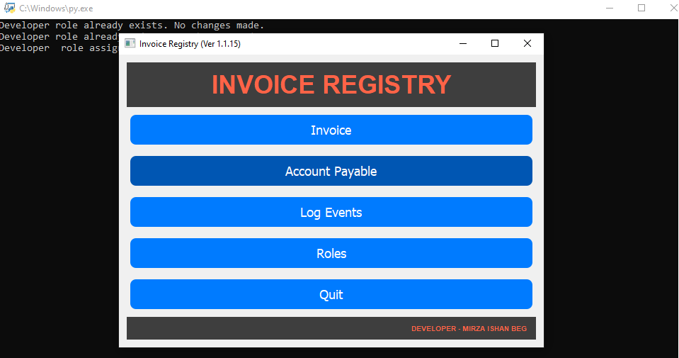
5. The above is the raw execution via python scripts, mostly what it will look like while running the CLI type of this file. I will be using this one for now in order to showcase what we can do by default.
6. Next, we can explore each components within this application, so here is the things this application provides (for quick overview and reference to that section):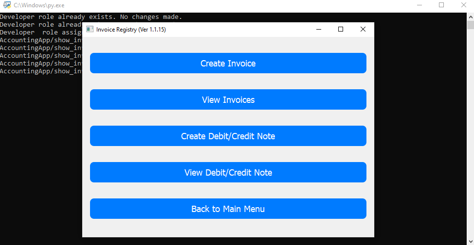

	1. **Create Invoice** 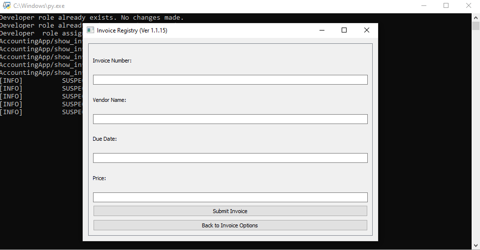
		- Showcase of fails and success scenarios.
		- Takes only 4 entries, 
			- Invoice number (must be unique on every successful entry,)
			- Name of vendor
			- Date
			- Price (Uni-currency for now.)

	2. **View Invoices**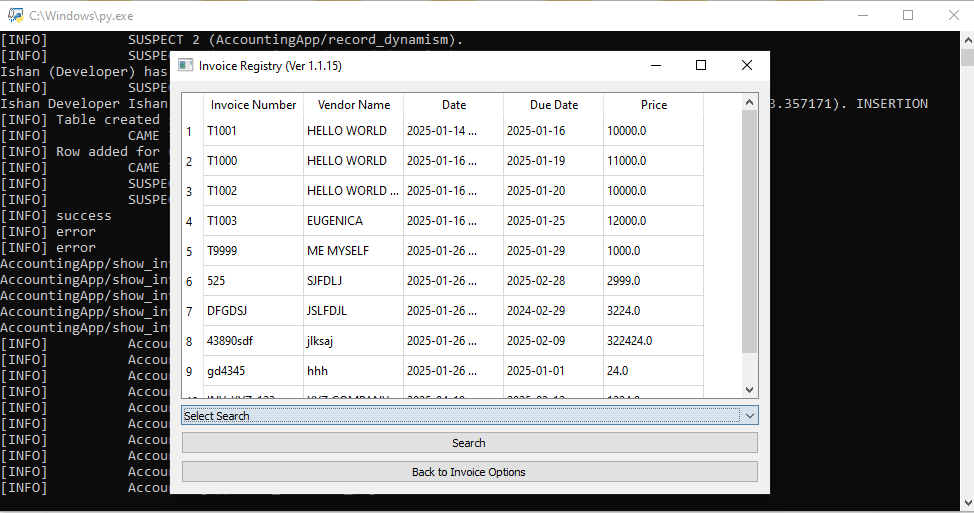
		- Can view, modify and delete invoices from here.
		- 5 Columns in total, as you can tell, current date is always automatically fetched from system's time and put into *Date* column. 
		- Search as per the first four columns.
		- **Note - deletion / modification process once successful, is irreversible!**

	3. **Create Debit/Credit Notes**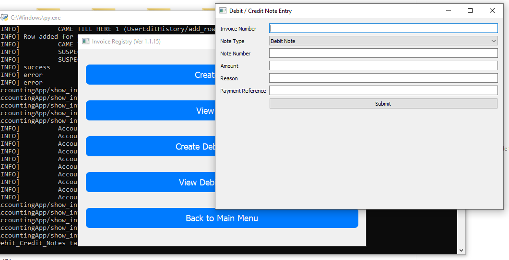
		- Prompts up a new screen, to allow looking back at the invoices in "View Invoices"
		- Takes 6 fields in total:
			- Invoice number to have a unique reference to the specific invoice
			- Note type is a drop-down button, with 2 options to select (Debit/Credit Note).
			- Note Number to create a unique Note.
			- Amount (Here, just enter the total calculated value.)
			- Reason input is to give a specific short idea as to what exactly caused the problem.
			- Payment reference is to put in any references of what type / transaction number was, in order to keep a track record of transactions.

	4. **View Debit/Credit Note**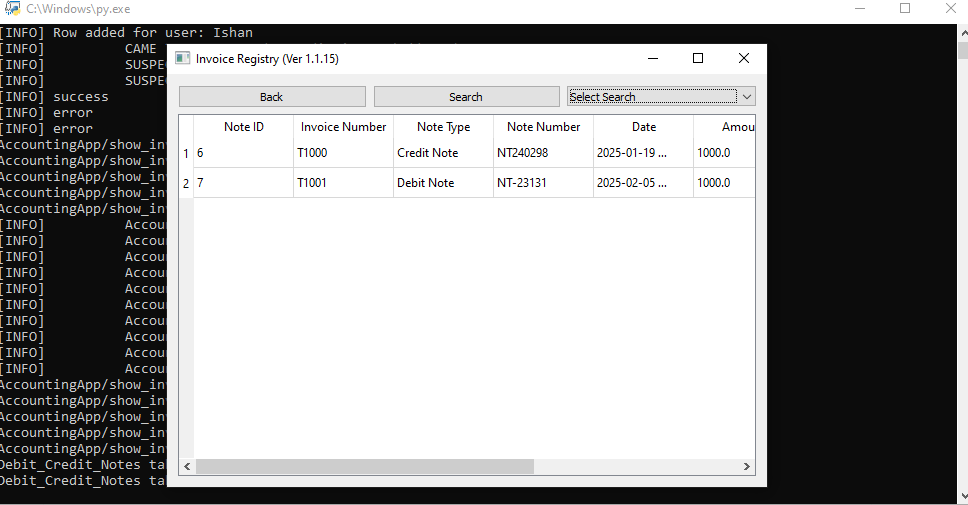
		- Prompts the section to read, modify and delete Credit / Debit notes.
		- current date is always automatically fetched from system's time and put into *Date* column. 
		- Search as per the Invoice number, Note number, and date.
		- **Note - deletion / modification process once successful, is irreversible!**
7.  Now going to the next button in the *Main Window / Welcome Screen*

	- **Account Payable** 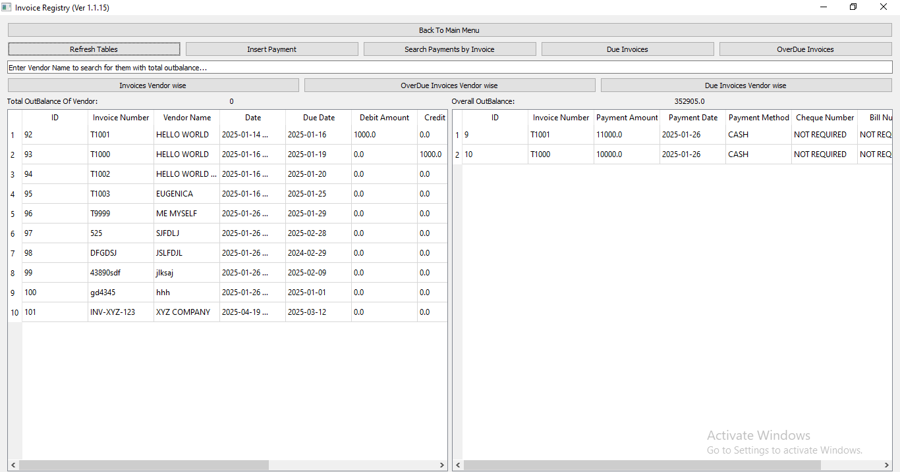
		- *Note - It is now that you may need to maximize your screen to be able to see options and table contents more easily.*
		- This table is where payments will be recorded. 
		- Payments for a specific invoice number can be done multiple times.
		- The system can detect if you submit amount higher than what the outstanding balance is.
	
		- **Main Features:**
			- Has the ability to fetch vendor wise total outstanding
			- FIRST HALF 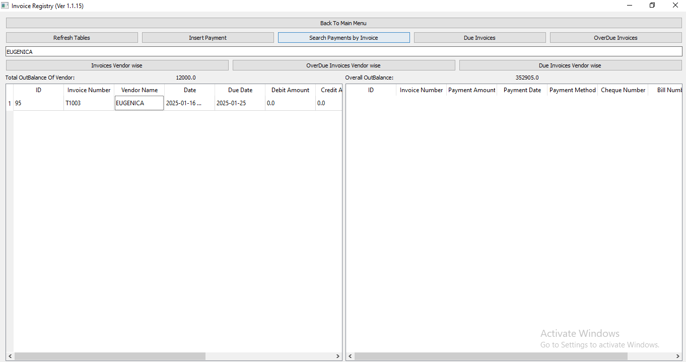
			- SECOND HALF 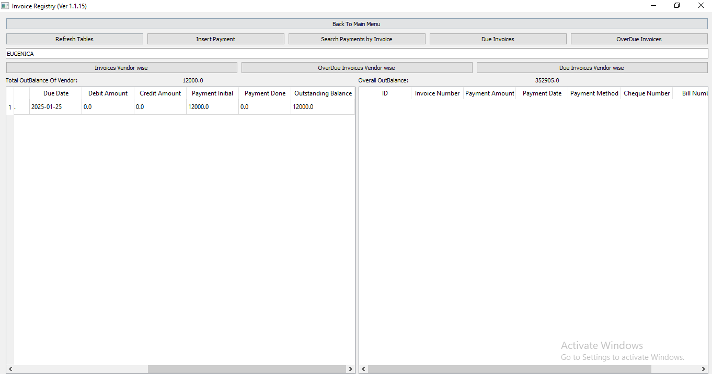
			- It also comes with search, here you only search payments table (But requires a minor fix here.)
			- One can also view as per due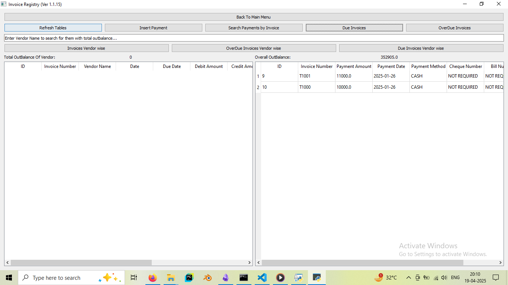
			- Or Over-due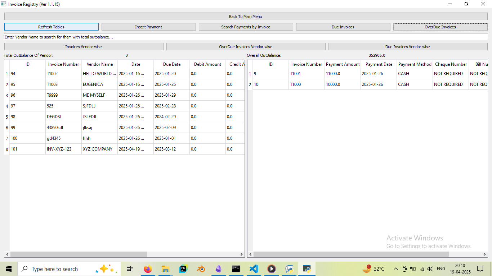

			- Or if you intend, you can get specific and put the name of the vendor in the vendor field below refresh button, then tap the 'Overdue Invoices Vender Wise' to get a more specific table for only vendors you intend to see.
			- Same goes for Due Invoices Vendor Wise.
			- But it is also a place for full CRUD of the payments, so modification, deletion, reading and creation of the payments of every invoice here.
8. Now, I want to elaborate basic log and roles screen -

	1. **Log Screen**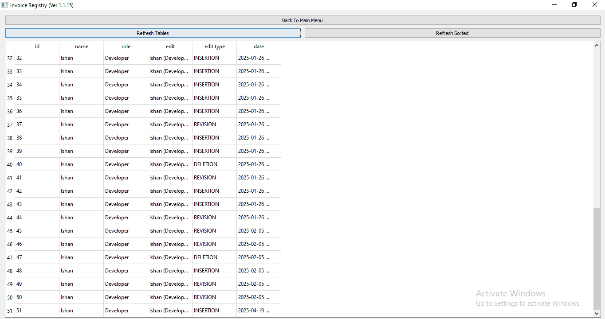
		- *Note: This is a maximized screen, you can minimize and it should look better and compact when not working with the accounts payable section.* 
		- This screen only has Read functionality (for any role user), for obvious reasons, one of which is to keep a track of whatever operations are performed. 
		- *Note - Tracks all except Read, Refresh, and Search Options.*

		- **Edit Type**
			- This has three main types,
				1. **REVISION** - If modification is conducted.
				2. **DELETION** - If Deletion is conducted.
				3. **INSERTION** - If new data entry occurs.

		- **Role**
			- Tells about what type of privilege a user has inside the application. This creates segmentation between permission a user can be assigned.
			- In program itself, it is as per "Class A, B, C, D" selection, while there are "Developer", "Manager", "Data Entry", "Data Viewer" roles.
				1. **CLASS A** - Only assigned to Developer, gives privilege over all functions and operations the developer can do.
				2. **CLASS B** - Assigned Only to Manager role, gives privileges over all functions and operations except the ability to change / delete Developer role assigned individuals.
				3. **CLASS C** - Assigned Only to Data Entry role, gives privileges only to create entries of any kind, (i.e. the C and R of CRUD is applicable for this role. Deletion / modification functionality is revoked from them.)
				4. **CLASS D** - Assigned Only to Data Viewer role, gives privileges only to Read entries of any kind, no kind of operations other than search functions can be performed by this kind of assigned role username.

		- **Edit** 
			- This column gives a more broad read as to what got inserted, deleted, modified.
	2.  **Role Screen**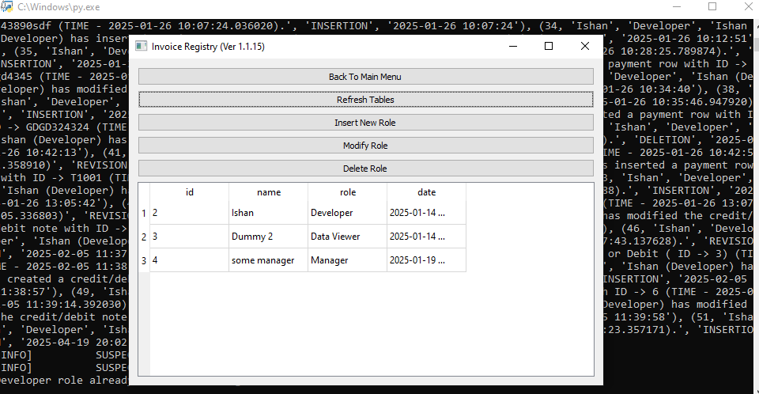
		- This section is about CRUD of the roles, as you may notice all operations can be performed in one place for roles of any new username.
		- This section also allows one to create and modify passwords of their own. 
		- *Note - Only Developer and Manager roles have the ability to modify anything here, refer the below list to understand why.*
		- **Role**
			- Tells about what type of privilege a user has inside the application. This creates segmentation between permission a user can be assigned.
			- In program itself, it is as per "Class A, B, C, D" selection, while there are "Developer", "Manager", "Data Entry", "Data Viewer" roles.
				1. **CLASS A** - Only assigned to Developer, gives privilege over all functions and operations the developer can do.
				2. **CLASS B** - Assigned Only to Manager role, gives privileges over all functions and operations except the ability to change / delete Developer role assigned individuals.
				3. **CLASS C** - Assigned Only to Data Entry role, gives privileges only to create entries of any kind, (i.e. the C and R of CRUD is applicable for this role. Deletion / modification functionality is revoked from them.)
				4. **CLASS D** - Assigned Only to Data Viewer role, gives privileges only to Read entries of any kind, no kind of operations other than search functions can be performed by this kind of assigned role username.
		- The date column stands there to give the time at which these usernames were created.
		- CRUD operations are almost completely similar just like the other tables we have talked about.
 9. This covers the most essential basics that one needs to know.
 10. When it comes down to modification, then **leaving empty fields except one** is acceptable, else you should cancel the dialog box for modification / go forward with other operations --like in the role section.-- or you can move back and then into the same screen in order to get a refreshed version of the GUI.

 ---
# Issues within the current version
 
 1. There will be certain functions that may fail, as far as I could find, there are two so far:
	 1. Search of payments gives a bugged result within the ID of payments.
	 2. Crash of the application if someone selects "modify" within roles section without selecting a row in the table.
2. Other issues like:
	1. Full CSS Implementation
	2. A better mechanism to be able to search through any tables. (Like a tag based system.)
	3. No reports for how much one can pay in a range (again, tag based system will solve this.)
	4. Calendar based action plan for having a representation of due dates against date of receiving is not available.
	5. The code has so far become more cramped, despite being quite modular.

---
# Solutions plan, and future updates

1. So far, I just intended to give a demo of what I am about to re-factor and fix. It was a project I had and wanted to fix it and test certain very sophisticated modular scripts which will ensure overall CSS implementation of the code (or at least, a default theme over all.)
2. My priority will be:
	1. [ ] Re-factor of the over all layout of functions and buttons, making sure an optimal setup of functions to not cramp up and make useless division of certain sections.
	2. [ ] Construction of basic tables from scratch, also making sure to have functions to be able to translate and transfer the data safely from this version to the re-factored one.
	3. [ ] Tag based systems implementation.
	4. [ ] Certain Auto-complete features to make data entry process much faster. 
	5. [ ] Calendar like representation of the payments tables. (Makes decision making for the next entry much easier to handle.)
	6. [ ] Rather than manual entries of dates, one would be prompted to select the date or could choose to type it down anyways.
3. Added on top of that, it will be all done in PyQt6, a more recommended version as per the their documentation on PYPI.
---
